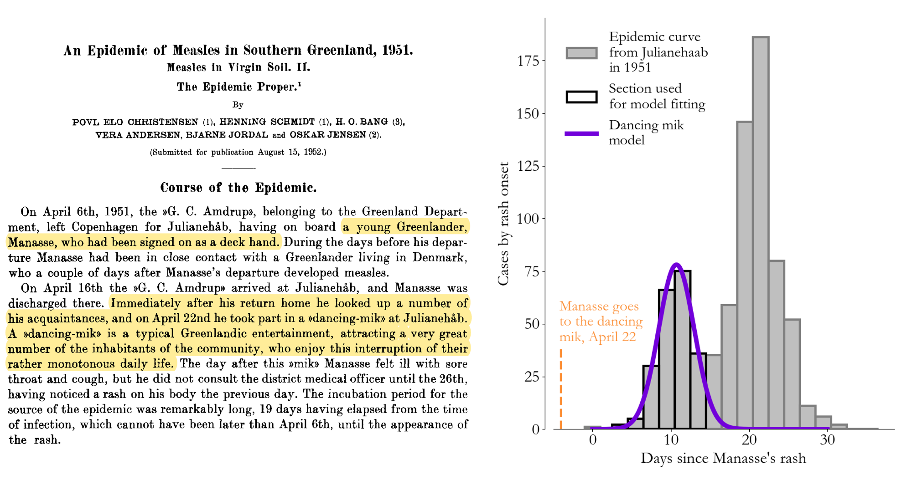

<!-- Alternative to the header image above --> 
<figure>

  

<figcaption>Combining epidemiological and statistical principles, in this case to estimate that it takes about 15 days for a rash to show up after you're exposed to measles.</figcaption>
</figure>

My work at [IDM](http://idmod.org) focuses on combining ideas from probability theory and classical epidemiology to better understand disease transmission, mostly in the measles and COVID contexts. Being at the [Gates Foundation](https://www.gatesfoundation.org/), I’ve placed particular emphasis on scientific communication and advocacy for informed decision-making, and I strive to align my mathematical research program with open questions in vaccine delivery and public health policy.

On this page I try to give a general overview of my work at [IDM](http://idmod.org) and where I think it's headed. If you're looking for some specific disease modeling projects, check out the epidemiology sections of [actual ignorance](https://nthakkar.github.io/actual_ignorance/). For a more comprehensive look at my work, see my [Google Scholar profile](https://scholar.google.com/citations?user=4XfFTrEAAAAJ&hl=en&oi=ao) or my [CV](../assets/docs/CV.pdf). 

The math and methods side...
--------------------------------------------

  

I worked in collaboration with the [Goldsmith group](https://goldsmith.chem.wisc.edu/) at UW Madison on understanding how whispering-gallery-mode-supporting microresonators can be used to make photothermal measurements of the optical properties of nanoscale systems and single molecules. This work was featured on [C&E News](http://cen.acs.org/articles/94/i45/Whispering-microresonators-detect-absorption-spectra.html?type=paidArticleContent) and [Nature News and Views](http://www.nature.com/nphoton/journal/v10/n12/full/nphoton.2016.237.html). 

For this project, I developed a dynamical systems model of the interaction between plasmonic particles and whispering gallery modes that can be used to statistically infer near-field properties of this hybrid system from my collaborators' experimental data. As we show in a [Nature Photonics article](http://www.nature.com/nphoton/journal/v10/n12/abs/nphoton.2016.217.html), these interacting systems support so-called Fano resonances, an interesting interference effect that my old group is continuing to study.

The policy and advocacy side...
--------------------------------------------

  

I worked in collaboration with the [Goldsmith group](https://goldsmith.chem.wisc.edu/) at UW Madison on understanding how whispering-gallery-mode-supporting microresonators can be used to make photothermal measurements of the optical properties of nanoscale systems and single molecules. This work was featured on [C&E News](http://cen.acs.org/articles/94/i45/Whispering-microresonators-detect-absorption-spectra.html?type=paidArticleContent) and [Nature News and Views](http://www.nature.com/nphoton/journal/v10/n12/full/nphoton.2016.237.html). 

For this project, I developed a dynamical systems model of the interaction between plasmonic particles and whispering gallery modes that can be used to statistically infer near-field properties of this hybrid system from my collaborators' experimental data. As we show in a [Nature Photonics article](http://www.nature.com/nphoton/journal/v10/n12/abs/nphoton.2016.217.html), these interacting systems support so-called Fano resonances, an interesting interference effect that my old group is continuing to study.

