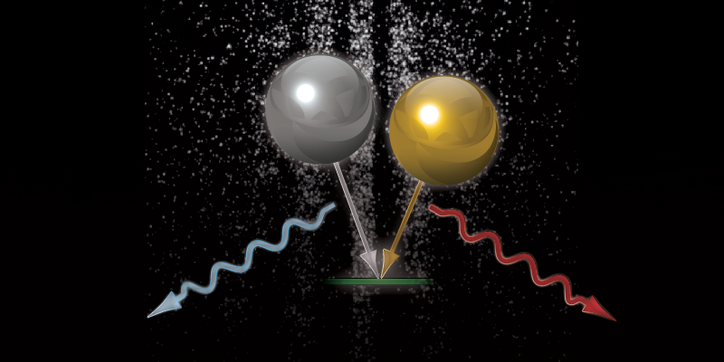
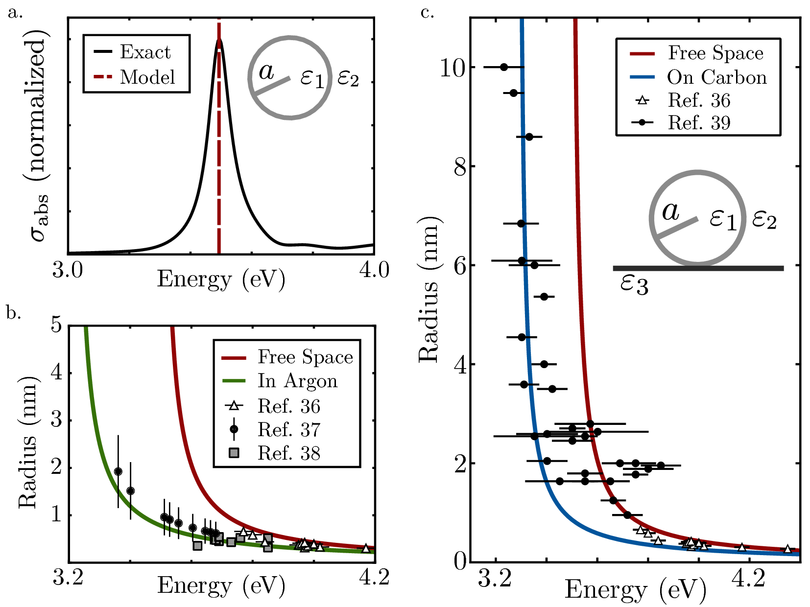

<!--<figure>

  

<figcaption> Image credit: <a href="https://nipaeason.com">Nipa Eason</a> </figcaption>
</figure>-->

My research focuses on manipulating charge and light at the nanoscale. For a list of my publications, look at my [Google Scholar Profile](https://scholar.google.com/citations?user=Op6vAucAAAAJ&hl=en&oi=ao)

Microresonators as platforms for nanoscience
--------------------------------------------

  

Sample text to explain this

From classical to quantum plasmonics
------------------------------------

  

Sample text for this section.
