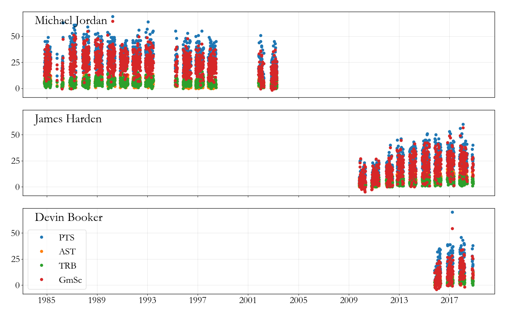

I've been (sorta) joking a lot about how [IDM](http://idmod.org) should use its new hardware for sports gambling. That (sorta) joke got taken a little further recently: I used [PyQuery](https://pythonhosted.org/pyquery/) to write a web scraper for [basketball-reference.com](https://www.basketball-reference.com/). My fantasy team still sucks this year (seriously, really bad), but this turned into a learning experience that's given me some interesting data so I thought I'd share.

I've wondered about web scraping for a while now. How do you do it? Is it legal ([yes?](https://stackoverflow.com/questions/32429445/is-web-scraping-allowed))? Is it hard? While I'm sure that people at Google do a much more sophisticated job, if you're looking to scrape data from a website with relatively consistent formatting, this set of PyQuery tools could probably be easily adapted or at least provide some inspiration.

The full code lives in a [repository](https://github.com/nthakkar/basketballref), so I'll just cover a short example here. At a high level, the library contains 4 major classes for players, box scores, season schedules, and team rosters respectively. These objects correspond to pages on basketball reference, and each object is an interface to scraping data contained in the tables on those pages. The objects are basically thin wrappers for the data. All of them have a `.df` attribute which is a [pandas](https://pandas.pydata.org/) dataframe containing the data from the specified page.

Let's take a look at the player object:

```python
class Player(object):

	""" Basic player object, which encapsulates player information and a dataframe of
	the player's game log. """

	def __init__(self,uri,seasons,advanced=True):

		""" uri = URL specific look up associated with the player. See the full player list for details.
		An example is jordami01 for Jordan, etc. """

		## Store the URI for reference
		self._uri = uri
		if advanced:
			base_urls = [GAMELOG_URL,ADV_GAMELOG_URL]
		else:
			base_urls = [GAMELOG_URL]
		
		## Loop over seasons to collect game logs for each -
		## seasons can be found in the full player list. This is 
		## encased in loop over URLs, since advanced stats are on
		## a seperate page
		to_merge = []
		for base_url in base_urls:
			
			## Initialize storage for all the data from
			## this base url (basic/advanced)
			dfs = []
			for season in seasons:

				## Get the webpage
				url = base_url.format(self._uri,season)
				webpage = pq(url)

				## In this case, some tables (particularly the playoff tables)
				## are hidden in the HTML comments (I don't understand this),
				## so I have to forcibly uncomment that section.
				webpage = str(webpage).replace("\n<!--\n","\n").replace("\n-->\n","\n")
				webpage = pq(webpage)

				## Extract the table from the webpage
				## as a dataframe.
				df = _process_webpage(webpage)

				## And append it to the list
				dfs.append(df)

			## Put it all together, index by date,
			## and save it to be merged.
			to_merge.append(pd.concat(dfs,ignore_index=True,sort=False).set_index("date"))

		## Merge if needed by finding new columns in the
		## advanced page and adding them to the basic page.
		if advanced:
			columns_to_add = to_merge[1].columns.difference(to_merge[0].columns)
			self.df = pd.concat([to_merge[0],to_merge[1][columns_to_add]],axis=1)
		else:
			self.df = to_merge[0]

		## Create a title based on the seasons selected.
		if len(seasons) == 1:
			self.title = uri+", {} game-log".format(seasons[0])
		else:
			self.title = uri+", {}-{} game-log".format(seasons[0],seasons[-1])
		self.title += (1-advanced)*" (basic only)"

	def __repr__(self):
		return self.title
```

The object is initialized with a URI (basketball reference's URL tag associated with the player. Jordan's is `jordami01`, and they can all be looked up with a helper function included in the library) and an iterable list of seasons. On initialization, the code loops over seasons and URLs (for basic and advanced stats) and collects data from all the associated webpages. Webpages are stored as PyQuery objects and parsing of those objects happens in the `_process_webpage` function. Check the repository for details if you're interested, but, briefly, the processing function uses PyQuery to iterate through HTML table classes on the page and collect the data we want.

That's it. The object has no other functionality, so in most cases it just facilitates retrieving a dataframe and organizing data from different sources. 

There's an example in the repository illustrating what you can do. If I want to compare some shooting guards (say Jordan, Harden, and Devin Booker), I can loop over their URIs, use the Player object to get all of their career basic and advanced stats in just a few seconds, and then look at how their statistics compare to one another. 
<figure>
<center>  </center>
<figcaption> Player stats pulled using the object above. See the full <a href="https://github.com/nthakkar/basketballref">repository</a> for more details.  </figcaption>
</figure>
Not a totally unflattering comparison for Booker? Although, looking at the [game scores](https://www.basketball-reference.com/about/glossary.html) (red dots) you can really see how Jordan was something else.


